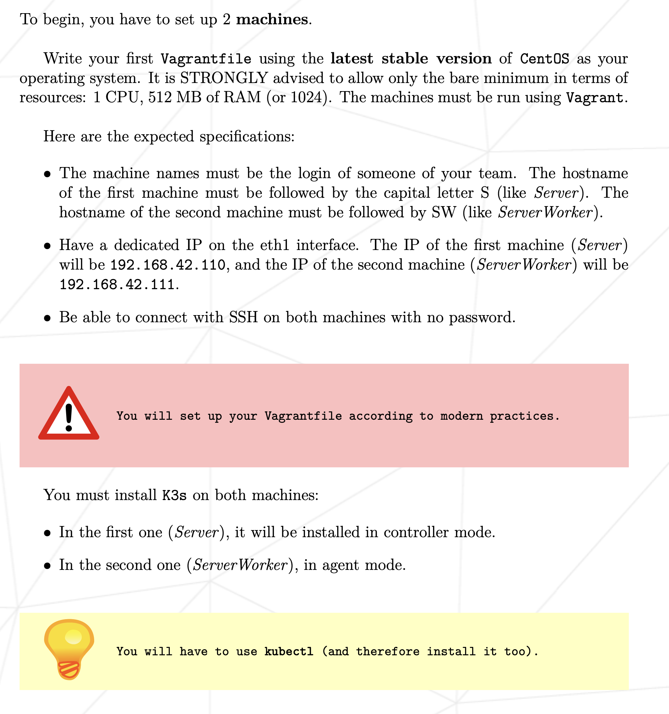
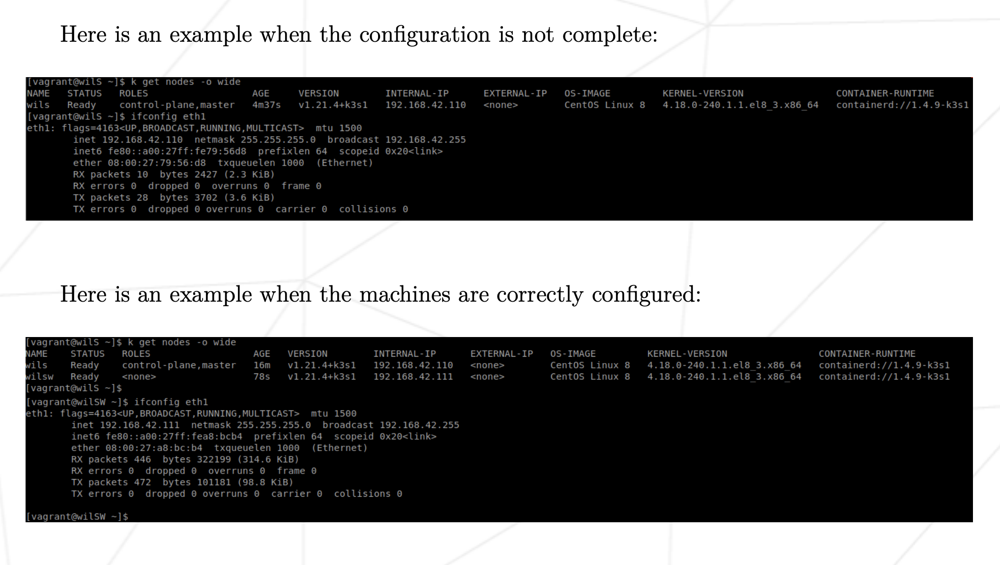
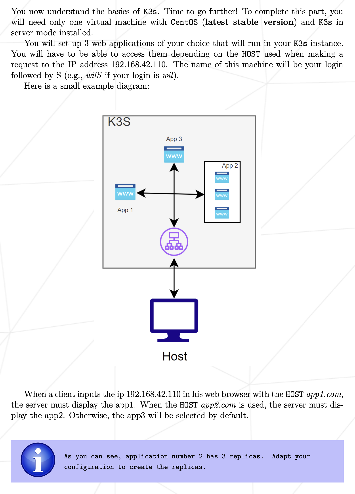
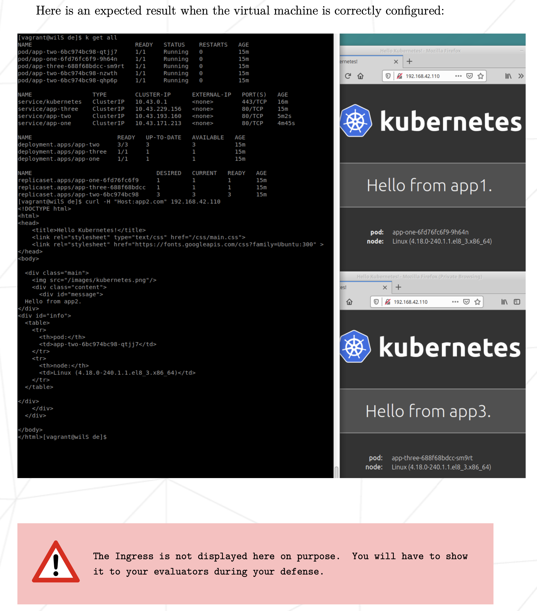
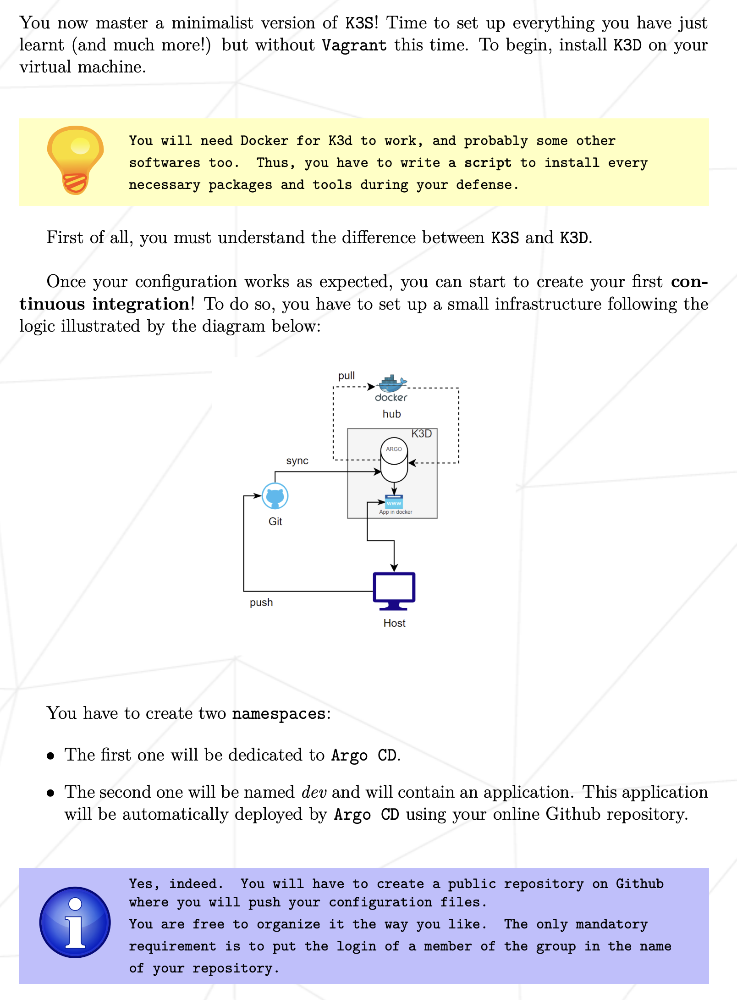
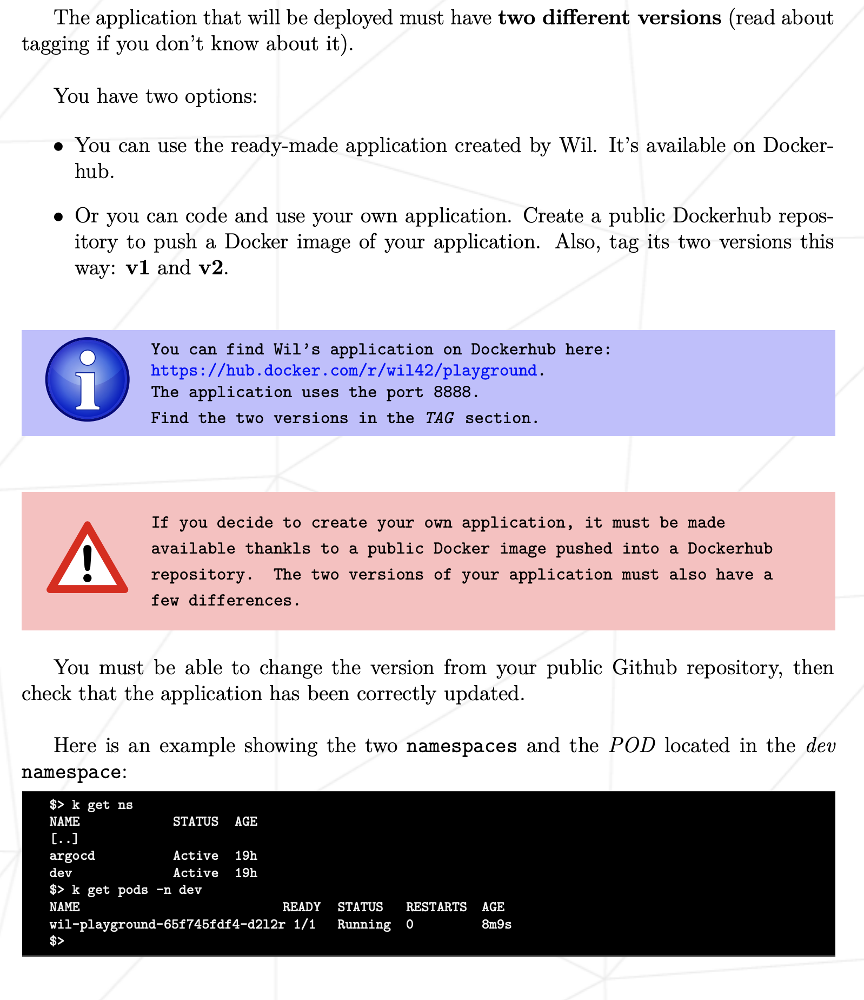
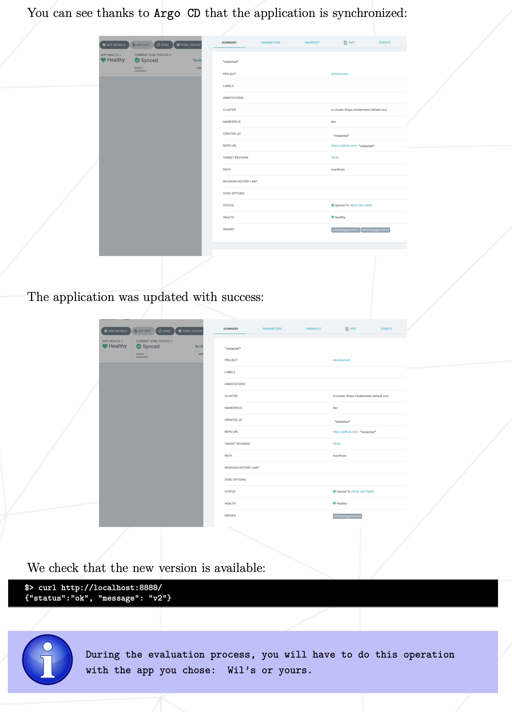

# Inception-of-Things
This project aims to introduce you to kubernetes from a developer perspective. You will have to set up small clusters and discover the mechanics of continuous integration. At the end of this project you will be able to have a working cluster in docker and have a usable continuous integration for your applications.

## Part 1: K3s and Vagrant

## Part 2: K3s and three simple applications

## Part 3: Part 3: K3d and Argo CD

